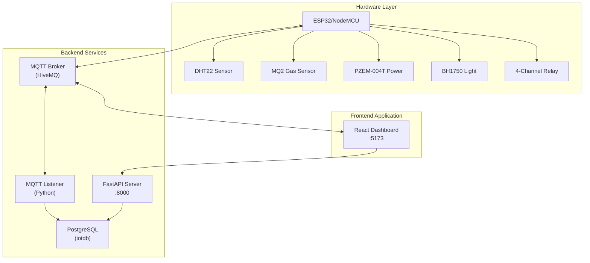
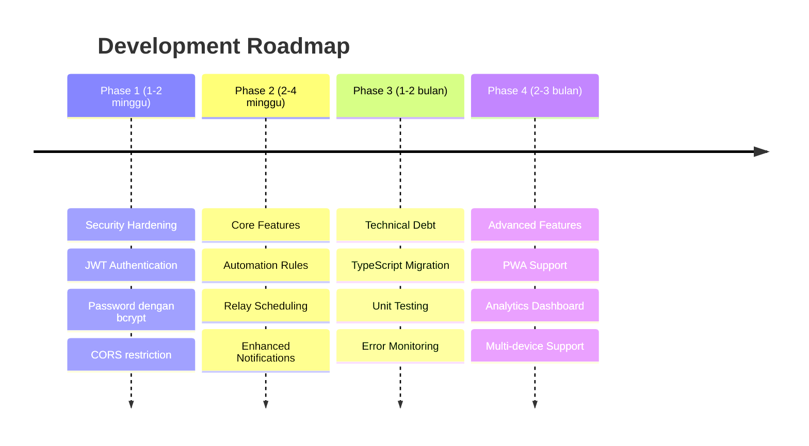

# Product Specification: Smart Home IoT Dashboard

## 📋 Ringkasan Eksekutif

Dokumen ini merupakan spesifikasi produk lengkap untuk **Smart Home IoT Dashboard** - sebuah sistem monitoring dan kontrol rumah pintar berbasis web yang mengintegrasikan berbagai sensor IoT dan aktuator relay melalui protokol MQTT.

---

## 1. Gambaran Umum Produk

### 1.1 Deskripsi Produk

Smart Home IoT Dashboard adalah aplikasi web berbasis React yang menyediakan antarmuka terpusat untuk:
- **Monitoring real-time** data sensor lingkungan (suhu, kelembaban, kualitas udara, konsumsi daya, intensitas cahaya)
- **Kontrol aktuator** relay 4-channel untuk mengendalikan perangkat rumah
- **Analisis historis** dengan visualisasi data dan export ke Excel
- **Sistem notifikasi** threshold-based untuk peringatan kondisi abnormal
- **Manajemen pengguna** dengan role-based access control

### 1.2 Arsitektur Sistem



### 1.3 Stack Teknologi

| Layer | Teknologi |
|-------|-----------|
| Frontend | React 18 + Vite, Chart.js, TailwindCSS |
| Backend API | FastAPI (Python), PostgreSQL |
| Real-time Communication | MQTT (Paho/mqtt.js) |
| Hardware | ESP32/NodeMCU, Arduino |

---

## 2. Fitur Produk

### 2.1 Dashboard Utama

| Fitur | Deskripsi | Status |
|-------|-----------|--------|
| Status MQTT | Indikator koneksi real-time dengan uptime | ✅ Implemented |
| Server Time | Waktu server dengan format Indo | ✅ Implemented |
| Suhu Ruangan | Pembacaan terbaru + statistik (min/avg/max) | ✅ Implemented |
| Daya Aktif | Konsumsi daya real-time + statistik | ✅ Implemented |
| Grafik Suhu & Kelembaban | Line chart dual-axis dengan gradient fill | ✅ Implemented |

### 2.2 Monitoring Sensor

#### DHT22 - Suhu & Kelembaban
- **Parameter**: Temperature (°C), Humidity (%)
- **Fitur**: Realtime chart, History mode, Export Excel
- **Threshold alerts**: Suhu tinggi/rendah, Kelembaban tinggi/rendah

#### MQ2 - Kualitas Udara
- **Parameter**: LPG (ppm), CO (ppm), Smoke level
- **Fitur**: Multi-line chart, Warning/Danger alerts
- **Threshold alerts**: Smoke warning, Smoke danger, Gas tinggi

#### PZEM-004T - Monitoring Daya
- **Parameter**: Voltage (V), Current (A), Power (W), Energy (kWh), Power Factor
- **Fitur**: Komprehensif power monitoring, Historical analysis
- **Threshold alerts**: Tegangan abnormal, Daya berlebih

#### BH1750 - Intensitas Cahaya
- **Parameter**: Lux (lumen per m²)
- **Fitur**: Light intensity tracking
- **Threshold alerts**: Cahaya terlalu terang/redup

### 2.3 Kontrol Relay (4-Channel)

| Relay | Nama Default | GPIO | Fungsi |
|-------|--------------|------|--------|
| 1 | Lampu Teras | 12 | Pencahayaan area depan |
| 2 | Pompa Air | 14 | Sistem irigasi otomatis |
| 3 | Exhaust Fan | 27 | Sirkulasi udara |
| 4 | Door Lock | 26 | Kunci elektronik |

**Fitur Relay:**
- Toggle ON/OFF via MQTT dengan QoS 1
- Sync status ke database untuk persistensi
- Rename relay sesuai kebutuhan
- Visual feedback dengan warna per relay

### 2.4 Sistem Autentikasi & Otorisasi

#### Roles
- **Admin**: Akses penuh (settings, user management, semua sensor)
- **User**: Akses terbatas (profil, monitoring sensor/relay)

#### Fitur Auth
- Login dengan username/password (SHA-256 hashed)
- Bootstrap admin (user pertama otomatis jadi admin)
- Force password change setelah reset oleh admin
- User management: Create, Delete, Reset Password

### 2.5 Pengaturan Sistem

#### Broker Settings (Admin Only)
- MQTT Host & Port konfigurasi
- Update interval (1-3600 detik)
- Reconnection handling dengan exponential backoff

#### Threshold Settings (Admin Only)
- Per-sensor threshold configuration
- Warning & Danger level untuk MQ2
- Real-time alert notification

#### Profile Settings (All Users)
- Update username
- Change password dengan konfirmasi

### 2.6 Riwayat & Export Data

#### Time Ranges
- 1 Hour, 6 Hours, 12 Hours, 24 Hours, 7 Days

#### Sampling
- Otomatis time-bucket aggregation untuk range besar
- Raw mode available untuk data detail

#### Export
- Excel format (.xlsx) dengan styling
- Semua riwayat sensor tersedia untuk download

---

## 3. Spesifikasi Teknis

### 3.1 API Endpoints

#### Auth Endpoints
```
POST /auth/login          - User login
POST /auth/register       - User registration
GET  /auth/check-admin    - Check admin exists
PUT  /auth/profile        - Update user profile
```

#### Sensor Endpoints
```
GET /latest/{sensor}      - Data terbaru per sensor
GET /history/{sensor}     - Data historis dengan range
GET /stats/{sensor}       - Statistik agregasi (min/max/avg)
GET /export/{sensor}      - Export ke Excel
```

#### Relay Endpoints
```
GET    /relays            - List semua relay
GET    /relays/{id}       - Get relay by ID
PUT    /relays/{id}       - Update status ON/OFF
PATCH  /relays/{id}/name  - Rename relay
```

#### Admin Endpoints
```
GET    /admin/users                 - List all users
POST   /admin/users                 - Create user
DELETE /admin/users/{id}            - Delete user
POST   /admin/users/{id}/reset-password - Reset password
```

### 3.2 MQTT Topics

```yaml
# Sensor Topics (Subscribe)
sensor/dht22:       { temp, hum, timestamp }
sensor/mq2:         { lpg, co, smoke, timestamp }
sensor/pzem004t:    { voltage, current, power, energy, power_factor }
sensor/bh1750:      { lux, timestamp }

# Relay Topics
command/relay/{id}: { state: "ON"|"OFF" }  # Publish
status/relay/{id}:  { state: true|false }  # Subscribe
```

### 3.3 Database Schema

```sql
-- Users Table
CREATE TABLE users (
    id SERIAL PRIMARY KEY,
    username TEXT UNIQUE NOT NULL,
    password_hash TEXT NOT NULL,
    role TEXT NOT NULL DEFAULT 'user',
    is_active BOOLEAN DEFAULT true,
    force_password_change BOOLEAN DEFAULT false,
    created_at TIMESTAMP DEFAULT NOW()
);

-- Relay Status Table
CREATE TABLE status_relay (
    id SERIAL PRIMARY KEY,
    name TEXT NOT NULL,
    gpio INT,
    is_active BOOLEAN DEFAULT false
);

-- Sensor Data Tables (per sensor)
CREATE TABLE data_dht22 (
    id SERIAL PRIMARY KEY,
    temperature FLOAT,
    humidity FLOAT,
    timestamp TIMESTAMP
);
-- Similar: data_mq2, data_pzem004t, data_bh1750
```

---

## 4. Non-Functional Requirements

### 4.1 Performance
- **Update rate**: Minimum 5 detik interval per sensor
- **Chart rendering**: Max 50 data points per chart (auto-trim)
- **API response**: < 500ms untuk query historis

### 4.2 Reliability
- **MQTT reconnection**: Exponential backoff (1s - 30s)
- **Maximum reconnect attempts**: 10
- **Database connection pooling**: 2-10 connections

### 4.3 Security
- Password hashing: SHA-256
- CORS configured untuk development
- Role-based access control

### 4.4 Usability
- Responsive design (mobile-first)
- Indonesian localization
- Toast notifications untuk alerts
- Loading states untuk semua async operations

---

## 5. Rekomendasi Perbaikan

Berdasarkan analisis codebase saat ini, berikut rekomendasi untuk meningkatkan kualitas dashboard:

### 5.1 Security Improvements

> [!CAUTION]
> **Critical Security Issues**

| Issue | Current State | Recommendation |
|-------|---------------|----------------|
| Password Hashing | SHA-256 (weak) | Migrate ke bcrypt atau Argon2 |
| Authentication | Plain token in localStorage | Implement JWT dengan refresh tokens |
| CORS | Allow all origins (`*`) | Restrict ke domain production |
| API Authorization | No middleware check | Implement proper auth middleware |

### 5.2 Feature Enhancements

> [!IMPORTANT]
> **High Priority Features**

1. **Automation Rules**
   - Trigger relay berdasarkan threshold sensor
   - Contoh: Fan ON jika suhu > 30°C

2. **Scheduling**
   - Timer untuk relay (auto ON/OFF)
   - Support multiple schedules per relay

3. **Mobile App / PWA**
   - Push notifications untuk alerts
   - Offline capability dengan service worker

4. **Data Analytics**
   - Trend analysis
   - Anomaly detection
   - Energy consumption reports

### 5.3 Technical Improvements

> [!TIP]
> **Best Practices**

| Area | Current | Recommendation |
|------|---------|----------------|
| State Management | Context API | Consider Zustand/Redux untuk scale |
| Error Handling | Basic try-catch | Global error boundary + Sentry |
| Testing | None | Add Jest + React Testing Library |
| TypeScript | None | Gradual migration untuk type safety |
| API Validation | Basic Pydantic | Add request validation middleware |
| Logging | Console.log | Structured logging (Winston) |

### 5.4 UI/UX Improvements

> [!NOTE]
> **Nice to Have**

1. **Dark Mode** - Support theme switching
2. **Dashboard Customization** - Drag-and-drop widget layout
3. **Multi-language** - English support selain Indonesian
4. **Accessibility** - ARIA labels, keyboard navigation
5. **Data Visualization** - Gauge charts, heatmaps untuk sensor data

---

## 6. Roadmap Prioritas



---

## 7. Kesimpulan

Dashboard IoT Smart Home ini sudah memiliki fondasi yang solid dengan fitur-fitur monitoring dan kontrol yang komprehensif. Untuk meningkatkan ke level production-ready, prioritas utama adalah:

1. **Security** - Perbaikan autentikasi dan otorisasi
2. **Automation** - Fitur rule-based automation
3. **Reliability** - Error handling dan monitoring yang lebih baik
4. **Scalability** - Arsitektur yang siap untuk multiple devices

Dengan implementasi rekomendasi di atas, dashboard ini akan menjadi solusi Smart Home IoT yang robust, aman, dan scalable.

---

*Document Version: 1.0*  
*Last Updated: 2025-12-16*  
*Author: Antigravity AI Assistant*
